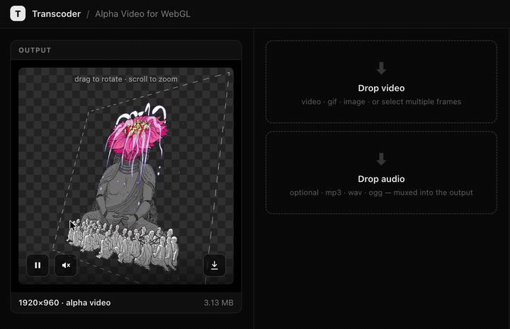

# EyeJack Transcoder / Alpha Video for WebGL

<p align="left"></p>

**EyeJack Transcoder** turns video, GIFs, and image sequences into compact,
**WebGL-ready H.264 / MP4** — including **transparent (alpha) video** — entirely in the
browser.

Transparent video on the web is genuinely hard: there's no single format that plays
everywhere. Chrome and Firefox do alpha via VP9/WebM, Safari only via HEVC — and the one
universal, hardware-decoded format (H.264/MP4) has **no alpha channel at all**. The
reliable cross-browser fix is to pack the **colour and alpha side-by-side** into one
ordinary MP4 and recombine them with a small **WebGL shader** at draw time: a standard
MP4 that plays anywhere yet composites to a transparent surface. This tool gives you that
standardized alpha-video pipeline in one step — no per-browser codec juggling.

## ▶ Try it live — [transcoder.eyejack.io](https://transcoder.eyejack.io/)

Drop a video, GIF, or image-sequence (transparency is auto-detected). It transcodes
**in your browser** via FFmpeg WASM — nothing is uploaded — previews the result on a
rotating 3D plane with the alpha recombined live, and lets you **download a
self-contained viewer**: a tiny `index.html` + the `.mp4` + the shader, ready to drop
straight into a project.

---

## Under the hood

- **Video** — video transcoding runs on **[FFmpeg WASM](https://github.com/ffmpegwasm/ffmpeg.wasm)**: FFmpeg (the industry-standard video tool) compiled to run *inside the browser*. It converts and compresses your video right on the page — no server, no install, no native apps.
- **Image** — images (resize, crop, pad, and handling transparency) are processed with the browser's built-in **Canvas**.

---

## Use it in your project

We built EyeJack Transcoder for **[EyeJack Creator](https://creator.eyejack.io)** — to
turn artists' animations into **alpha video for AR**: transparent clips that play in
WebGL/WebAR scenes consistently across phones and browsers, with no per-device codec
juggling.

To add it to your own app:

**1. Build it and add it as a dependency.**

```bash
git clone https://github.com/julapy/eyejack-transcoder.git
cd eyejack-transcoder && npm install && npm run build
```
```jsonc
// your package.json
"dependencies": { "@eyejack/transcoder": "file:../eyejack-transcoder" }
```

**2. Serve the FFmpeg assets and isolate the page.** Copy this package's
[`public/ffmpeg/`](./public/ffmpeg) to your app's `/ffmpeg`, and send these headers
(FFmpeg WASM needs `SharedArrayBuffer`):

```
Cross-Origin-Opener-Policy: same-origin
Cross-Origin-Embedder-Policy: require-corp
```

**3. Transcode.** Create one `Transcoder` (optionally tuned), then feed it any media —
type and transparency are auto-detected per input:

```ts
import { Transcoder, transcodeFile, transcodeSequence, fileSystem } from '@eyejack/transcoder';

const transcoder = new Transcoder({
  ffmpegBaseURL: '/ffmpeg',
  transcodeSettings: {                  // all optional — sensible defaults otherwise
    maxBitrate: '8M',                   // output bitrate ceiling
    maxAnimationDuration: 30,           // trim to N seconds
    maxVideoDimensions: {               // downscale cap (longest side fits)
      noAlpha: { w: 1920, h: 1920 },
      alpha:   { w: 1024, h: 1024 },    // alpha output is packed 2× wide (colour | alpha)
    },
  },
});

const a = await transcodeFile(transcoder, videoFile);                  // plain video → mp4
const b = await transcodeFile(transcoder, transparentGif);             // transparent gif → alpha mp4
const c = await transcodeFile(transcoder, videoFile, { audio });       // + mux an external audio track
const d = await transcodeSequence(transcoder, pngFrames /* File[] */); // image sequence → mp4

const blob = await fileSystem.readFile(a.path);   // each call returns { path, kind }; read it as a Blob
```

Inputs can be a `File`, `Blob`, or URL. Auto-detection can be overridden per call with
`{ type, hasAlpha }`.

---

## Agent API

The transcoder runs entirely in the browser and mirrors its operations onto `window`, so
an **AI agent** (browser automation, an MCP browser tool, or just the devtools console)
can drive the *same* pipeline a person does — no special integration. The hosted tool at
[transcoder.eyejack.io](https://transcoder.eyejack.io/) exposes this surface, or attach
it yourself in your app.

```js
// available on window wherever the harness is mounted:
const out  = await window.transcodeFile(fileOrUrl, { audio });   // → { path, kind }
const info = await window.probeMedia(out.path);                  // codec / resolution / fps / audio
const blob = await window.fileSystem.readFile(out.path);         // the output mp4 Blob
window.__transcodeLog;                                           // full event + ffmpeg log
```

Also on `window`: `transcodeSequence(frames, opts)`, `transcodeFixture(url, opts)`
(fetch a URL, then transcode), and `transcoder.cancel()`. Every call returns a promise,
so an agent can `await` it and read the result, probe, and log directly.

---

## License

[MIT](./LICENSE)
